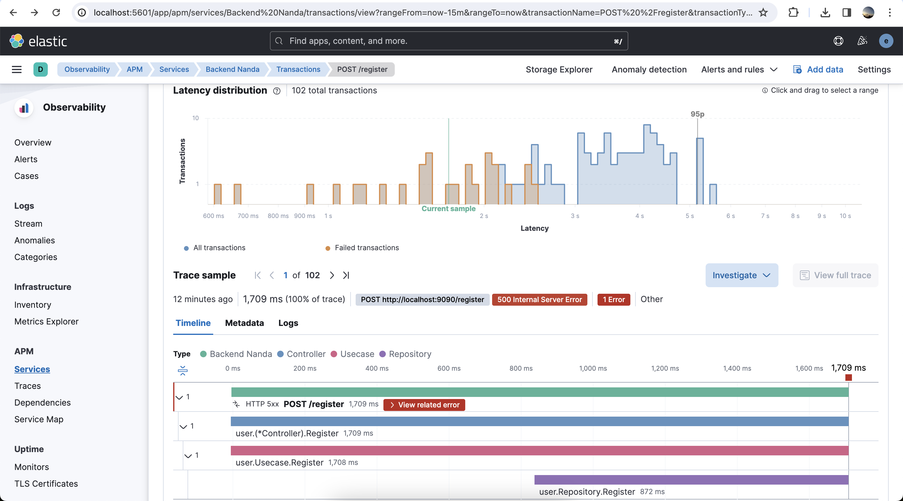
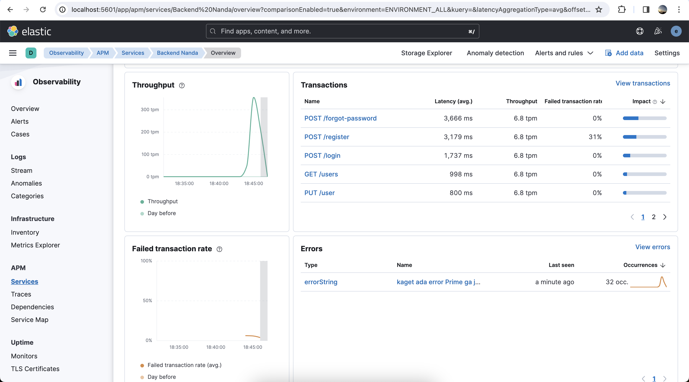

# APM (Application Performance Monitor) With Elastic Stack

Distributed Tracing, Matrix And Logging With Elastic Stack






## Usage

### Install Elastic Stack
```bash
cd elk-stack
docker compose up -d
```

### Start Backend Apps
```bash
cd backend
go mod tidy
go run app/main.go
```

### Running Load Test
```bash
k6 run load-test.js
```


## Tech Stack

**Load Testing:** [Grafana K6](https://k6.io/)

**Backend:** [Golang](https://go.dev/), [Gin](https://gin-gonic.com/)

**Observability:** [Elastic Stack](https://www.elastic.co/)

## Credential


### Elastic
Username : elastic

Password : changeme


## Reference

[APM Agent](https://github.com/elastic/apm)

[Docker ELK](https://github.com/deviantony/docker-elk)

